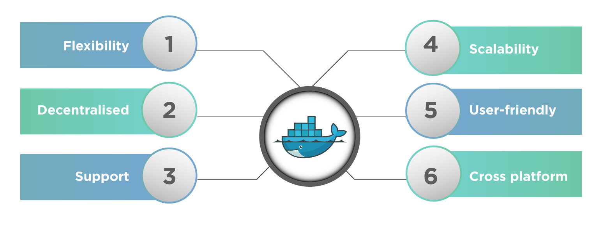
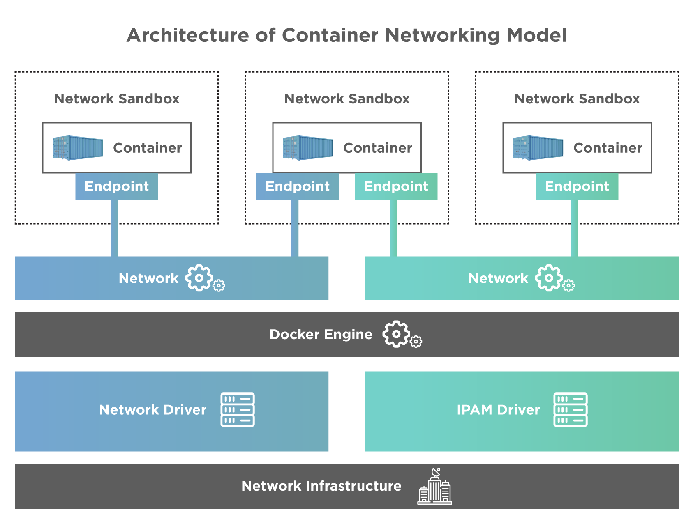
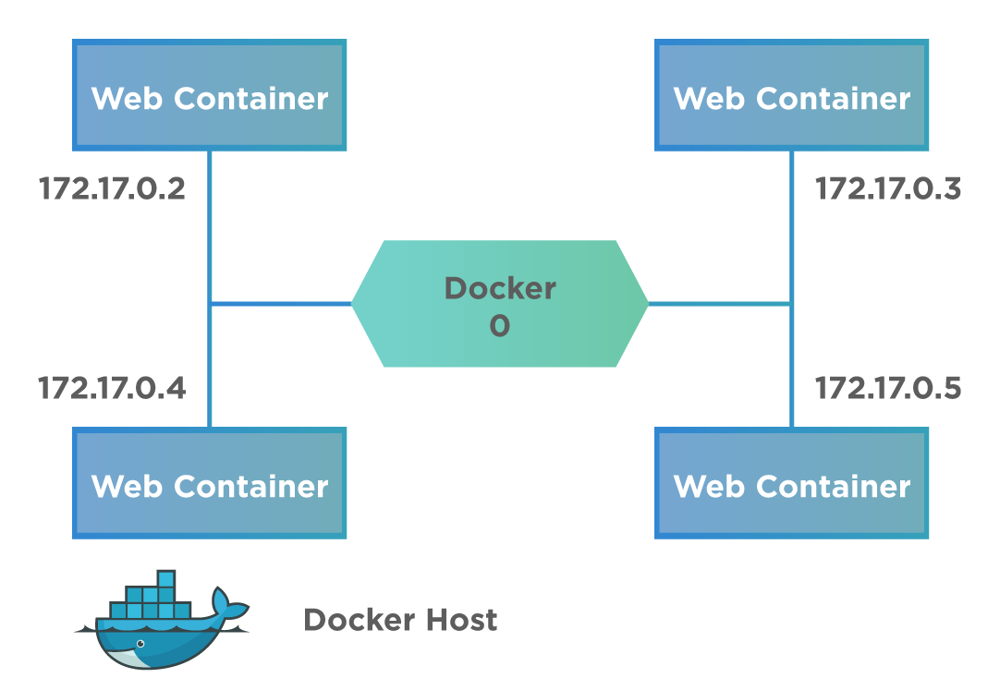
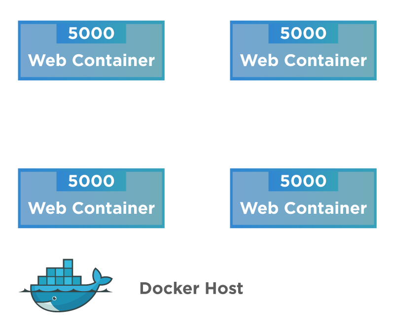
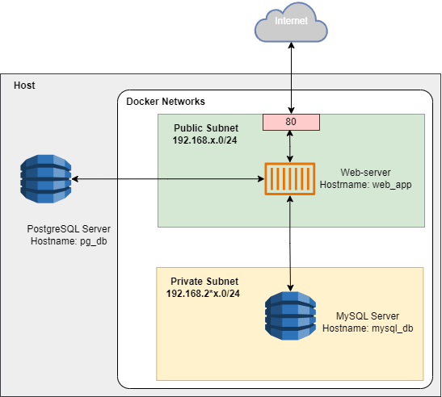

# Лабораторна робота №5. Docker networking

## Мета: Ознайомитися з основними можливостями мережевих драйверів Docker.

### Теоритичні відомості

`Docker networking` дозволяє створити мережу контейнерів Docker, якою керує головний вузол, який називається менеджером.
Контейнери всередині мережі Docker можуть спілкуватися один з одним, обмінюючись пакетами інформації.

**Мережа** — це група з двох або більше пристроїв, які можуть спілкуватися один з одним фізично або віртуально.
**Мережа Docker** — це віртуальна мережа, створена Docker для забезпечення зв’язку між контейнерами Docker.
Якщо два контейнери працюють на одному хості, вони можуть спілкуватися один з одним без необхідності відкривати порти
для хост-машини.
Ви можете використовувати Docker для керування своїми хостами Docker на будь-якій платформі, незалежно від того, чи
працюють вони під керуванням Windows, Linux або іх комбінації.

Docker Network, як правило, має такі характеристики або цілі:



- **Гнучкість** – забезпечує гнучкість для різних додатків на різних платформах, щоб вони могли спілкуватися один з
  одним.
- **Крос-платформність** – ми можемо використовувати кластери Docker Swarm та Docker на різних серверах.
- **Масштабованість** – будучи повністю розподіленою мережею, програми можуть масштабуватися та рости окремо,
  забезпечуючи при цьому продуктивність.
- **Децентралізація** – мережа Docker є децентралізованою. Це дозволяє програмам бути високодоступними та розподіленими.
  Якщо якийсь контейнер або хост відсутній з пулу
  ресурсів, ми можемо передати його сервіси іншим доступним ресурсам або ввести новий ресурс.
- **Дружність до користувача** – розгортання сервісів є простішим.
- **Підтримка** – Docker пропонує підтримку з коробки, і його функціональність проста та зрозуміла, що робить мережі
  Docker легкими у використанні.

Існує "Модель мережі контейнерів (CNM)", яка підтримує всі наведені вище функції.

Модель мережі контейнерів (Container Network Model) (CNM) використовує кілька мережевих драйверів для забезпечення
мережі для контейнерів.
CNM стандартизує кроки, необхідні для надання цієї мережі. CNM зберігає конфігурацію мережі в розподіленому сховищі
ключ-значення, такому як консоль.
Архітектура CNM показана нижче:



Як видно з діаграми вище, CNM має інтерфейси для IPAM і мережевих плагінів. Плагін IPAM APIS може створювати/видаляти
пули адрес і виділяти/звільняти IP-адреси контейнерів, щоб додавати або видаляти контейнери з мережі.
API мережевих плагінів використовуються для створення/видалення мереж і додавання/видалення контейнерів із мережі.

Наведена вище діаграма показує основні об’єкти CNM:

**Мережевий контролер (Network Driver)** - надаэ простий API для створення або видалення мереж та додавання або
видалення контейнерів з мереж.
**Драйвер (IPAM Driver)** - використовуватися для створення та видалення пулів адрес, а також для виділення або
звільнення IP-адрес контейнерів.
**Мережа** - забезпечує з’єднання між кінцевими точками однієї мережі та ізолює їх від решти. Відповідний драйвер
отримує сповіщення щоразу, коли мережа оновлюється або створюється заново.
**Кінцева точка** - забезпечує зв’язок між службами, що надаються одним контейнером мережі, з іншими службами, що
надаються іншими контейнерами. Кінцева точка має глобальну область і є службою, а не контейнером.
**Пісочниця** - створюється, коли користувач надсилає запит на створення кінцевої точки в мережі. Пісочниця може мати
більше однієї кінцевої точки, підключеної до різних мереж.

Для ефективної роботи з мережею Docker необхідні спеціальні драйвери. Існує кілька драйверів за замовчуванням, які
забезпечують основні функції для мережевої взаємодії:

- **none** - драйвер відключає всі мережеві ресурси для контейнера, що може бути корисним у випадках, коли мережеве
  з'єднання не потрібне.
- **bridge** - є стандартним мережевим драйвером. Він створює міст між контейнером і хостовою машиною, що дозволяє
  контейнерам спілкуватися один з одним. Містові мережі зазвичай використовуються, коли додатки працюють в автономних
  контейнерах і потребують взаємодії.
- **host** - усуває мережеву ізоляцію між контейнером і хостом Docker. Контейнер безпосередньо використовує мережеві
  ресурси хоста, що може бути корисно для певних застосунків, які потребують швидкого доступу до мережі.
- **overlay** - забезпечують зв’язок між кількома демонами Docker, що дозволяє контейнерам на різних хостах спілкуватися
  один з одним. Це особливо корисно в середовищах з багатьма серверами.
- **macvlan** - дозволяють контейнерам отримувати унікальні MAC-адреси, завдяки чому вони виглядають як фізичні пристрої
  в мережі. Це дозволяє спростити інтеграцію контейнерів у вже існуючі мережі.
- **ipvlan** - дозволяє контейнерам отримувати IP-адреси з існуючої мережі хоста, відрізняється від macvlan, оскільки не
  використовує MAC-адреси, а зосереджується на IP-адресах.

### Bridge network



З точки зору Docker, bridge мережа використовує програмний міст, який дозволяє контейнерам,
підключеним до однієї мостової мережі, обмінюватися даними, водночас забезпечуючи ізоляцію від контейнерів, які не
підключені до даної мережі.
Визначені користувачем мережі типу міст забезпечують автоматичне розвязання DNS між контейнерами на відміну від мережі
яка створюється за замовчуванням.
Контейнери можна приєднувати та від'єднувати від визначених користувачем мереж на льоту

### Host network



Якщо ви використовуєте host мережевий режим для контейнера, мережевий стек цього контейнера не ізольований від хоста
Docker
(контейнер спільно використовує мережевий простір імен хоста), і контейнеру не призначається власна IP-адреса.
Наприклад, якщо ви запускаєте контейнер, який прив’язується до порту 80, і використовуєте host мережу, програма
контейнера доступна на порту 80 на IP-адресі хоста.
Слід звернути увагу, що контейнер не має власної IP-адреси під час використання мережевого режиму host, відображення
портів не діє, а параметри `-p`, `--publish`, `-P` та `--publish-all`ігноруються.
Мережа в режимі хоста може бути корисною для наступних випадків використання:

- Для оптимізації продуктивності
- У ситуаціях, коли контейнер повинен працювати з великою кількістю портів

Мережа host підтримується на Docker Desktop версії 4.34 і пізніших. Щоб увімкнути цю функцію:

- Перейдіть до Налаштувань .
- На вкладці «Ресурси» виберіть «Мережа».
- Поставте прапорець біля опції «Увімкнути мережу хоста».
- Виберіть Застосувати та перезапустіть.
- 
  **Обмеження**
- Процеси всередині контейнера не можуть прив’язуватися до IP-адрес хоста, оскільки контейнер не має прямого доступу до інтерфейсів хоста.
- Функція хост-мережі Docker Desktop працює на рівні 4. Це означає, що на відміну від Docker у Linux, мережеві протоколи, які працюють нижче TCP або UDP, не підтримуються.
- Ця функція не працює, якщо ввімкнено покращену ізоляцію контейнерів, оскільки ізоляція ваших контейнерів від хоста та надання їм доступу до хост-мережі суперечать одне одному.
- Підтримуються лише контейнери Linux. Мережа хосту не працює з контейнерами Windows.

Приклад використання:

```shell

# How to run php app with mysql db (host network) 
сd <php app folder>

docker build --tag my-php .
# Run mysql container in host network
docker run --rm -d --name my-mysql-container -e MYSQL_ROOT_PASSWORD=mysql -e MYSQL_DATABASE=test_db --network host mysql:latest
# Run php app container in default bridge network
docker run --rm -d -p 8080:80 --name my-php-container --add-host db:192.168.56.1 --hostname my-php-hostname my-php
curl http://localhost:8080
  Ping unsuccessful!
  Connected successfully
docker exec -it my-php-container /bin/bash
cat /etc/hosts
  127.0.0.1       localhost
  ::1     localhost ip6-localhost ip6-loopback
  fe00::0 ip6-localnet
  ff00::0 ip6-mcastprefix
  ff02::1 ip6-allnodes
  ff02::2 ip6-allrouters
  192.168.56.1    db
  172.17.0.2      my-php-hostname
```

## Завдання

1. Ознайомитися з теоретичним матеріалом.
2. Створити дві мережі типу bridge - `public-net-<firstname>` та `private-net-<firstname>` (рис 1).
3. Створити елементариний додаток на мові програмування за вибором, який буде виводити на екран свою IP-адресу та дані з
   двох баз дані з двох СКБД (MySql та PostgreSQL).
4. Запустити контейнери MySql та PostgreSQL з необхідними параметрами оточення та іменами mysql_db та `pg_db`
   відповідно.
5. Підключити контейнер MySql до мережі `private-net-<firstname>` а контейнер PostgreSQL до мережі `host`.
6. Запустити контейнер з додатком та підключити його до обох мереж та додати запис DNS для зв'язку зf ім'ям `pg_db`.
7. Перевірити підключення до відповідних мереж використовуючи команду `docker inspect`.
8. Перевірити роботу додатку в браузері.
9. Зупинити та видалити контейнери та мережі.
10. Всі команди та результати виконання відобразити у звті.


де х - номер в журналі академічної групи.

Рисунок 1 - Схема мережі

## Контрольні питання

- Які основні функції виконує драйвер bridge у мережі Docker?
- Чим відрізняються драйвери macvlan і ipvlan в контексті їх роботи з мережевими адресами?
- Як драйвер host впливає на мережеву ізоляцію між контейнером і хостом Docker?
- У яких випадках доцільно використовувати драйвер none?
- Для яких типів додатків найкраще підходить драйвер host, і чому?
- Які переваги надає використання драйвера macvlan для контейнерів у вже існуючій мережі?
- Як драйвери впливають на продуктивність контейнерів у Docker?
- Які фактори слід враховувати при виборі мережевого драйвера для конкретного застосунку?


